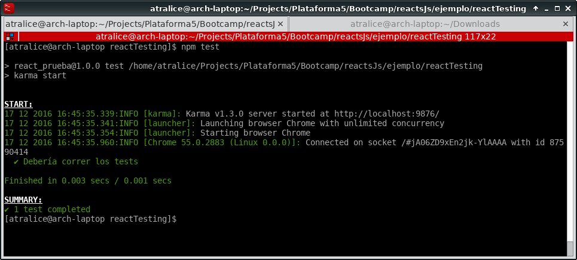
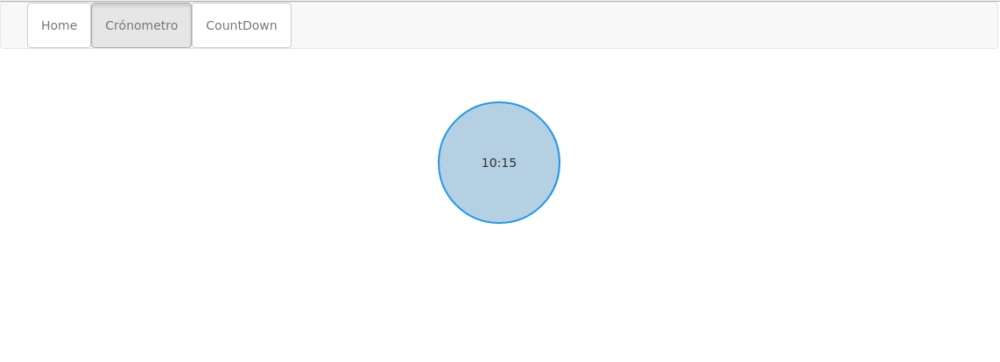
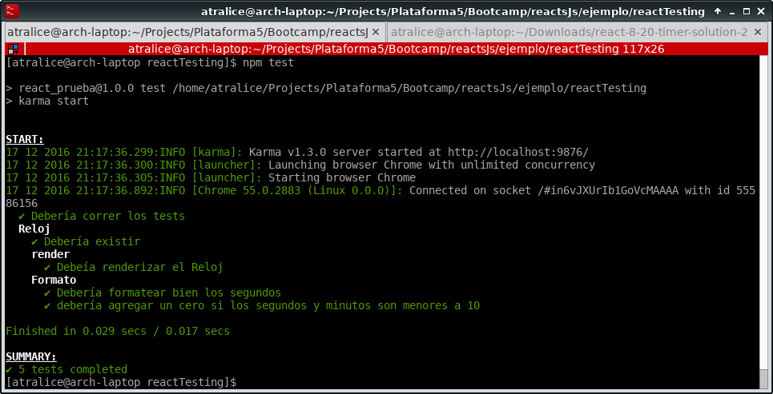
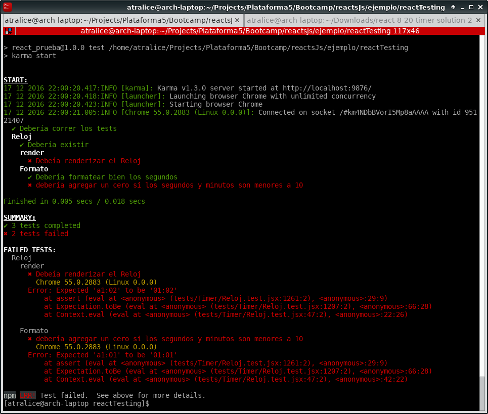

# Testing y Lifecycle de los Componentes

Una de las cosas interesantes de React, es que está pensado para ser _testeable_ y además nos provee una serie de herramientas para hacerlo.

Primero vamos a elegir qué herramienta de __assertion__ vamos a usar, en este ejemplo vamos a usar una llamda [`expect`](https://github.com/mjackson/expect).

También vamos a necesitar una librería para organizar nuestros tests, en este caso vamos a usar `Mocha`.

Por último, como vamos estamos testeando Front-End, vamos a necesitar alguna herramienta para poder ejecutar código en el browser. Esta herramienta va a ser [`karma`](https://karma-runner.github.io/1.0/index.html). 

Además, como `karma` puede trabajar con una variedad de otros paquetes, vamos a tener que instalar algunos paquetes específicos para funcionen en conjunto, en nuestro ejemplo `webpack` y `mocha`.

```
Karma is essentially a tool which spawns a web server that executes source
code against test code for each of the browsers connected. The results of each
test against each browser are examined and displayed via the command line to
the developer such that they can see which browsers and tests passed or failed.
```

Como siempre, lo primero que vamos a hacer es instalar todos los paquetes necesarios: `npm install --save-dev mocha expect karma karma-chrome-launcher karma-mocha karma-mocha-reporter karma-webpack`

> Según en qué browsers querramos ejecutar pruebas va a ser probable que tengamos que instalar más paquetes. 

## Configurando Karma

Karma funciona muy parecido a _Webpack_ en el sentido que hay que configurar qué cosas queremos que haga por nosotros antes de empezar. Veamos un archivo de configuración llamado `karma.conf.js` y expliquemos que es cada cosa:

```javascript
var webpackConfig = require('./webpack.config.js');

module.exports = function (config){
    config.set({
        browsers: ['Chrome'],
        singleRun: true,
        frameworks: ['mocha'],
        files: ['tests/**/*.test.jsx'],
        preprocessors: {
            'tests/**/*.test.jsx': ['webpack']
        },
        reporters: ['mocha'],
        client: {
            mocha: {
                timeout: '5000'
            }
        },
        webpack: webpackConfig,
        webpackServer: {
          noInfo: true
        }
    });
}
```

* _browsers_: Acá especificamos en cuales browsers vamos a ejecutar nuestros tests.
* _singleRun_: Esto le indica a Karma si tiene que cerrar el browser una vez que se terminen de correr todas las pruebas. En el caso que usemos Karma para testar mientras codeamos, lo seteamos a false y nos ahorramos el tiempo de abrir y cerrar el browser.
* _frameworks_: La lista de testing frameworks que queremos usar con Karma, tipicamente van a ser `mocha`, `jasmine` o `qunit`. Noten que vamos a tener que instalar un paquete especifico aparte para cada framework.
* _files_: Aca pasamos un arreglo de Strings diciendo qué archivos queremos que ejecuten como parte de los tests, en nuestro caso usamos wildcards para decir que todo lo que esté en la carpeta `tests` (incluyendo subdirectorios) que termine en la extensión `test.jsx` tiene que ser ejecutados como tests.
* _preprocessors_: Aca indicamos para cada archivo por cuáles preprocesadores queremos pasarlos antes de ejecutarlos, en nuestro caso queremos que todos los archivos antes pasen por `webpack` antes de correr nuestro test.
* _reporters_: Aquí indicamos qué herramienta vamos a utilizar para que nos muestren los reportes del resultado de nuestros tests.
* _client_: En client podemos setear configuraciones para las herramientas que va a invocar Karma, en este caso seteamos la configuración del TimeOut de `mocha` para que sea de 5000 ms.
* _webpack: Cómo vamos a usar `webpack` como preprocesador, tenemos que indicarle a Karma el archivo de configuración de `webpack` que vamos a usar, por eso lo requerimos al principio y se lo pasamos en esta configuración.
* _webpackServer_: Si usaramos un servidor web manejado por Webpack, entonces aquí pondríamos su configuración, como no es el caso, declaramos que no hay información sobre eso.

> [Aquí](https://karma-runner.github.io/1.0/config/configuration-file.html) la documentación completa del config file de Karma.

Por último, queremos configurar un comando para ejecutar los tests automáticamente, para eso vamos a ir al `package.json` de nuestro proyecto y vamos a agregar está línea en scripts:

```javascript
    "scripts": {
        "test": "karma start"
    }
```

Ahora vamos a crear un test trivial, para ver si todo lo que hemos instalado está funcionando bien. Vamos a crear un archivo `./tests/prueba.test.jsx`:

```javascript
var expect = require('expect');

it('Debería correr los tests', function() {
    expect(1).toBe(1);
});
```

Si vemos este output, quiere decir que tenemos todo instalado y configurado para comenzar:




## Escribiendo tests

Ahora vamos a escribir un pequeño Componente de ejemplo, para poder ver cómo se testean Componentes de react. Vamos a crear un Componente que sea un Reloj, básicamente lo que tiene que hacer es recibir una cantidad de tiempo expresados en segundos, y dibujar un reloj marcando ese tiempo, pero en formato `mm:ss`. Por ejemplo, si pasamos `615` segundos, debería aparecer un reloj mostrando: `10:15`. Como se ve en la imagen de abajo:



Básicamente, nuestro Componente `Reloj`, debería tener recibir como `props` el tiempo en segundos, y tener una función que formatee ese número a `mm:ss` y luego renderize en pantalla. Esto lo conseguimos con el siguiente código:

```javascript
var React = require('react');

var Reloj = React.createClass({
  getDefaultProps: function () {
    tiempo: 0
  },
  propTypes: {
    tiempo: React.PropTypes.number
  },
  formatSeconds: function (tiempo) {
    var segundos = tiempo % 60;
    var minutos = Math.floor(tiempo / 60);

    if (segundos < 10) {
      segundos = '0' + segundos;
    }

    if (minutos < 10) {
      minutos = '0' + minutos;
    }

    return minutos + ':' + segundos;
  },
  render: function () {
    var {tiempo} = this.props;

    return (
      <div className="reloj">
        <span className="reloj-text">
          {this.formatSeconds(tiempo)}
        </span>
      </div>
    );
  }
});

module.exports = Reloj;
```

> También podríamos haber buscado alguna librería que sirva para formatear tiempo, pero era lo suficentemente simple para hacerlo nosotros :D.

Ahora vamos a empezar a realizar los siguientes tests sobre nuestro `Reloj`:
    * El reloj debe existir: Cuando importamos el Componente, no debe estar vacio.
    * El Reloj se debería renderizar en la página: Cuando incluimos el Componente con una cantidad de segundos, debería aparecer el reloj en la página con el tiempo formateado.
    * Debería formatear bien el tiempo: Si le pasamos una cantidad de segundos determinadas, debería formatealo en `mm:ss`
    * Debería agregar ceros si los segundos y minutos son menores a diez: Por ejemplo: `62 seg` => `01:02`

Para poder realizar estar pruebas, vamos a necesitar instalar un nuevo `addon`, este se llama `react-addons-test-utils`, que es una libería que nos ofrece React que contiene varias funciones que nos van a servir para testear nuestros componentes, podemos ver toda su funcionalidad en su [documentación](https://facebook.github.io/react/docs/test-utils.html#renderintodocument).

Bien, ahora podemos empezar a escribir tests. Vamos a crear un nuevo archivo `/tests/Timer/Reloj.test.jsx`. Primero vamos a requerir todo lo que vamos a usar en nuestro test:

```javascript
var React = require('react');
var ReactDOM = require('react-dom');
var expect = require('expect');
var $ = require('jquery/dist/jquery.js');
var TestUtils = require('react-addons-test-utils');

var Reloj = require('../../components/Reloj.js');
```

> Para requerir jquery buscamos el archivo no minificado, hay un problema con webpack y jquery si incluimos el js minificado.

Luego, vamos a empezar a describir y agrupar los tests que mencionamos antes usando las funciones `describe` y `it` de `mocha`:

```javascript
describe('Reloj', () => {
  it('Debería existir', () => {
    
  });

  describe('render', () => {
    it('Debería renderizar el Reloj', () => {
     
    });
  });

  describe('Formato', () => {
    it('Debería formatear bien los segundos', () => {
     
    });

    it('debería agregar un cero si los segundos y minutos son menores a 10', () => {
    
    });
  });
});
```

Ahora la primera prueba que queremos hacer, es si `Reloj` existe cuando lo requerimos:

```javascript
it('Debería existir', () => {
    expect(Reloj).toExist();
});
```

> Este test parece trivial, pero no siempre vamos a estar seguros qué pasa despues si un Componente es undefined, tal vez los siguentes tests pasan y no nos damos cuenta nunca.

Bien, ahora vamos a probar si nuestro `Reloj` se renderiza y formatea los segundos que le pasamos. En este test vamos a utilizar la función `renderIntoDocument`, que lo que hace es renderizar un Componente de React en el DOM. En este caso Karma se encarga de proveer el DOM en donde va renderizar el Componente, y vamos a guardar la referencia a ese Componente en una variable.
Luego vamos a usar esa variable para buscar el el elemento con `jQuery`, y controlar que efectivamente el tiempo formateado sea el correcto. En este test, vamos a pasar `62` segunos como `prop` al Reloj, por lo tanto esperamos que el texto dentro del mismo sea `01:02`.

```javascript
it('Debería renderizar el Reloj', () => {
      var reloj = TestUtils.renderIntoDocument(<Reloj tiempo={62}/>);
      var $el = $(ReactDOM.findDOMNode(reloj));
      var actualText = $el.find('.reloj-text').text();

      expect(actualText).toBe('01:02');
    });
```

En algunos tests, nos servirá sólo renderizar el Componente para tener acceso a sus funciones internas. En este ejemplo, queremos probar solámente si la función `formatSeconds` funciona correctamente. Para eso incorporamos el Componente y luego invocamos la función, finalmente comparamos el resultado de ella con el resultado esperado:

```javascript
it('Debería formatear bien los segundos', () => {
      var reloj = TestUtils.renderIntoDocument(<Reloj/>);
      var seconds = 615;
      var expected = '10:15';
      var actual = reloj.formatSeconds(seconds);

      expect(actual).toBe(expected);
    });
```

Los tests de Reloj completos:

```javascript
describe('Reloj', () => {
  it('Debería existir', () => {
    expect(Reloj).toExist();
  });

  describe('render', () => {
    it('Debería renderizar el Reloj', () => {
      var reloj = TestUtils.renderIntoDocument(<Reloj tiempo={62}/>);
      var $el = $(ReactDOM.findDOMNode(reloj));
      var actualText = $el.find('.reloj-text').text();

      expect(actualText).toBe('01:02');
    });
  });

  describe('Formato', () => {
    it('Debería formatear bien los segundos', () => {
      var reloj = TestUtils.renderIntoDocument(<Reloj/>);
      var seconds = 615;
      var expected = '10:15';
      var actual = reloj.formatSeconds(seconds);

      expect(actual).toBe(expected);
    });

    it('debería agregar un cero si los segundos y minutos son menores a 10', () => {
      var reloj = TestUtils.renderIntoDocument(<Reloj/>);
      var seconds = 61;
      var expected = '01:01';
      var actual = reloj.formatSeconds(seconds);

      expect(actual).toBe(expected);
    });
  });
});
```

para ejecutarlos, vamos a la carpeta del proyecto y hacemos `npm test`. Una vez ejecutado vamos a ver los resultados de los tests con este formato:



En el caso de arriba, todos los tests pasaron. Ahora vamos a cambiar el código de `Reloj` para que la función `formatSecond` formatee mal el tiempo a propósito:

```javascript
formatSeconds: function (tiempo) {
    var segundos = tiempo % 60;
    var minutos = Math.floor(tiempo / 60);

    if (segundos < 10) {
      segundos = '0' + segundos;
    }

    if (minutos < 10) {
      minutos = 'a' + minutos; // incorporamos un error
    }

    return minutos + ':' + segundos;
  }
```

Ejecutamos los tests de nuevo:



Genial! nuestros tests no pasaron. Ahora sabemos que si introducimos un error sin querer, no van a pasar los tests y lo vamos a poder corregir rápidamente.

## Sourcemaps

Por último, vamos a ver lo que son los `sourcemaps` y cómo usarlos. 
Cuando codeamos en React el código que escribimos es pasado por uno o varios `transpilers`, por lo tanto el código que es _ejecutado_ en el browser ( o en otro ambiente ) es bastante distinto al que escribimos nosotros. Esto no nos molesta _a priori_, sobre todo si todo anda bien. Pero cuando hay errores, es muy probable que el browser nos diga `hay un error en la línea 20341`, cuando ninguno de nuestros Componentes tiene más de 100 líneas. Esto se debe a que `webpack` puso todo nuestro código en un sólo archivo, además que convirtió el código `JSX` a `JS` puro.

Para poder debugear bien, lo óptimo sería que veamos el código que hemos escrito nosotros en los errores y no el código `transpilado`. Para eso nos sirven los `sourcemaps`, que como el nombre indica crean un _mapa_ entre el código fuente y lo que finalmente es ejecutado. Para usarlos en `webpack`, vamos a agregar la siguiente línea al final de nuestro config file:

```javascript
    ...,
    devtool: 'cheap-module-eval-source-map'
    }
```

y en el config de `karma`, vamos a agregar `sourcemap` como un `preprocessor`:

```javascript
...
preprocessors: {
            'tests/**/*.test.jsx': ['webpack', 'sourcemap']
        },
...
```

Listo, ahora vamos los errores van a ser más fáciles de encontrar!