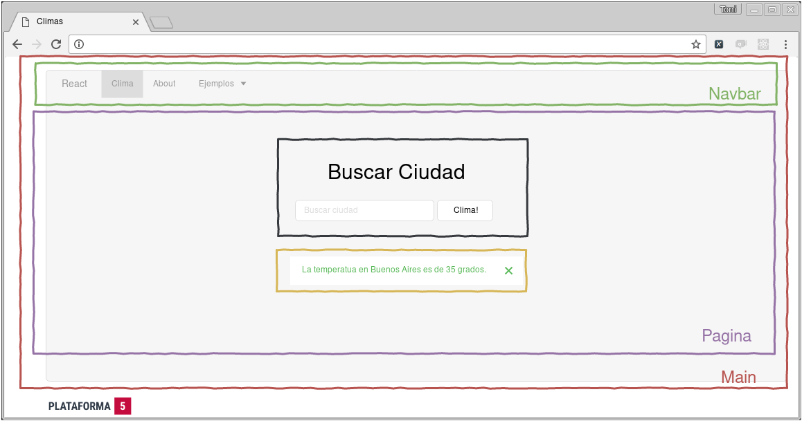

# Ejercicio React

## Página de Clima

Para empezar a utilizar vamos a crear una app en donde sólo nos interese mostrar algunos datos. Esto es muy común cuando trabajamos en el front-end de un Proyecto y tenemos que consumir datos de un back-end o API que es externo a nosotros.

En este caso, vamos a construir una SPA que nos sirva para consumir y mostrar datos del Clima de distintas ciudades.

Vamos a usar la API pública de [OpenWeatherMap.com](https://openweathermap.org/current) para buscar cuidades y mostrar el clima de esa ciudad.

> Van a tener que crear una cuenta ( es gratis ) y obtener un `api-key` para pasarla con cada _request_ al API.

Veamos un ejemplo de cómo debería estar estructurada nuestra app. En el mismo tenemos marcados los Componentes que deberíamos hacer:

> Esto es sólo la _primera_ separación en Componentes, según cada página que tengan que hacer va a convenir separar en un segundo nivel de Componentes o no.

Nuestra página va a tener:

* __Main__: Es el Componente principal, 
* __Nav__: Este Componente renderiza una barra de navegación, con Links que nos van a permitir movernos por toda la app.
* __Página__: Este Componente va a mantener estado y llamar a los Componentes que están dentro de él.
* __Input__: Este Componente se va a encargar de recibir el input de la ciudad.
* __Output__: Este Componente va a mostrar el resultado de la búsqueda de la ciudad que haya ingresado el usuario en el _Input_.

Algunas features que tiene que tener nuestra app:

* Si no encuentra la Ciudad, debería mostrar una cartel avisándonos esto.
* Si hay un error en traer los datos (por ejemplo, la API está caida, o el key no es válido) nos debería dar un mensaje diciendo que intentemos de nuevo más tarde.
* Durante la consulta a la API en el Output se debería mostrar un cartel o imagen que indique que la consulta se está realizando.

Con respecto a nuestro código:

* Separar cada Componente en un archivo .jsx separado.
* Separar Componentes que sean Presentacionales y codearlos como _pure functions_ o _Stateless Functional Components_.
* Separar los Componentes que mantengan estados y distinguirlos en alguna carpeta llamada `Containers`.
* Usar _Props Types_ y definir las props que son necesarias en cada Componente.
* Para hacer consultas a la API utilizar alguna librería que utilice `Promises` (axios, superagent, fetch, etc...)

Si quieren pueden seguir [este _guideline_](https://github.com/airbnb/javascript/tree/master/react) para React utilizado por [airbnb](https://www.airbnb.com/). (Está pensado para ES6). 