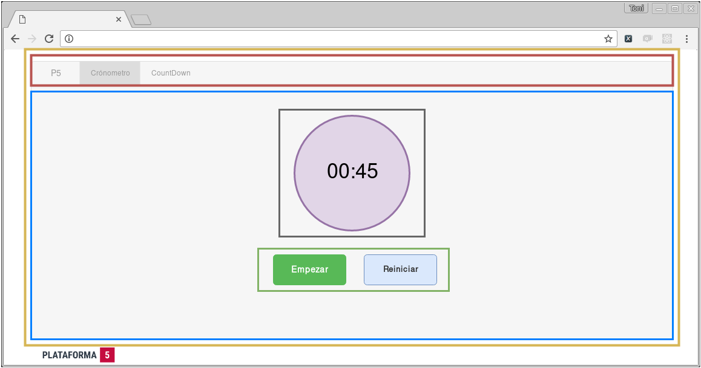
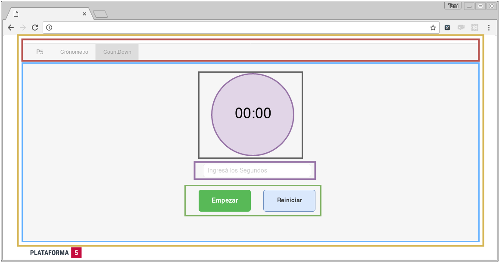

# Testing y Lifecycle de los Componentes

Esta nueva app no va a consumir datos de ningún lado, pero va a tener que mantener un estado, que va a ir cambiando según lo que haga el usuario en la página.

Vamos a codear un Timer y un CountDown. En el primero, va a haber un reloj que empiece en cero, cuando el usuario haga click en `Empezar`, el reloj va a empezar a contar segundos, el Botón se deberá cambiar a `Pausar`, y si el usuario lo clickque se deberá pausar el cronómetro. Siempre al lado habrá un botón de reiniciar, que volverá el reloj a cero.

Para CountDown, vamos a pedir un input al usuario: un número entero que respresente una cantidad de segundos a contar. El reloj iniciará en la cantidad de segundos que introdujo el usuario y empezará a decrecer hasta llegar a cero, en ese caso se mostrará una alerta. De nuevo va a aparecer el botón de pausar cuando el reloj esté en funcionamiento, y el de Reiniciar para volver a comenzar.

En las imagenes de arriba podemos ver los _mockups_ de lo que tenemos que codear. Podemos distinguir los siguientes _componentes_ y _containers_ (que podremos reutilizar):

* Componentes Presentacionales: Estos componentes __no tienen estado__ simplemente se van a renderizar mostrando lo que le pasemos por props:
    - __Reloj__ (línea negra): Nuestro reloj recibe por props un _tiempo_ en milisegundos y lo formatea con el formato `hh:mm:ss`.
    - __Botonera__ (línea verde): Va a recibir un _status_, que indica si el contador esta contando o está parado. Y va a recibir una función que es la que se ejecutará cuando se presionen los botones.
    - __Input de segundos__ (línea violeta): Recibe una función que modifica la cantidad de segundos que va a contar el contados.
    - __Container Principal__ (línea celeste): Este container va a contener (invocar) a los demás Componentes. Además va a mantener el estado del reloj, y es donde vamos a definir las funciones que pasaremos a los demás Componentes.

---

En este ejercicio vamos a tener que:

* Codear la menor cantidad de Componentes, o sea, reutilizar al máximo.

---

## Extra

* Testar cada Componente de manera automática para asegurarnos que todo funcione bien. Deberán escribir y pasar (por lo menos) los siguientes tests:
    + __Reloj__:
        *El reloj debe existir: Cuando importamos el Componente, no debe estar vacio.
        - El Reloj se debería renderizar en la página: Cuando incluimos el Componente con una cantidad de segundos, debería aparecer el reloj en la página con el tiempo formateado.
        - Debería formatear bien el tiempo: Si le pasamos una cantidad de segundos determinadas, debería formatealo en `mm:ss`
        - Debería agregar ceros si los segundos y minutos son menores a diez: Por ejemplo: `62 seg` => `01:02`
    + __Botones/Controles__:
        * Debe existir.
        * Cuando el reloj está contando, el botón debería decir 'pausar' en vez de 'comenzar' ( o los nombres que ustedes elijan )
        * Cuando el reloj está pausado, el botón debería decir 'empezar'.
    + __Crónometro__:
        * Debe existir:
        * Debería empezar a contar el tiempo cuando el status es 'contando' ( o el nombre que ustedes elijan ).
        * Debería detener el contador cuando el status este en 'pausado'.
        * Debería retornar a cero cuando el status sea 'detenido'.
    + __Countdown Input__:
        * Debería existir.
        * Debería invocar a la función para empezar a contar cuando se pasa una cantidad de segundos válidos:
        * No debería invocar la función si los segundos pasados no son válidos.
        
        > Para este test les va a servir usar `spy` de [`expect`](https://github.com/mjackson/expect#spy-tohavebeencalled)
   
    + __CountDown__:
        * Debería existir:
        * Debería empezar el reloj en el tiempo submiteado, y empezar a contar hacia abajo.
        * Nunca debería contar a un número menor a cero.
        * Debería frenar de contar cuando está en estado 'pausado'.
        * Debería resetear cuando está en estado 'detenido'.
